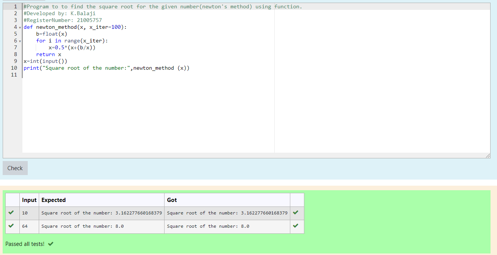

# Find the square root of a number

## AIM:
To write a program to find the square root of a number.

## Equipments Required:
1. Hardware – PCs
2. Anaconda – Python 3.7 Installation / Moodle-Code Runner

## Algorithm
1. Define a function.
2. Assign number_iters = 100 in the function to perform 100 iteratios.
3. Set i = 0.
4. Calculate  number = 0.5 * (number + a / number) for 100 iterations.
5. Return number

## Program:
```
/*
Program to find the square root for the given number(newton's method) using function.
Developed by: K.Balaji
RegisterNumber:  21005757

def newton_method(x, x_iter=100):
    b=float(x)
    for i in range(x_iter):
        x=0.5*(x+(b/x))
    return x
x=int(input())  
print("Square root of the number:",newton_method (x))
*/
```

## Output:



## Result:
Thus the program to find the square root for the given number(newton's method) using function is written and verified using python programming.
